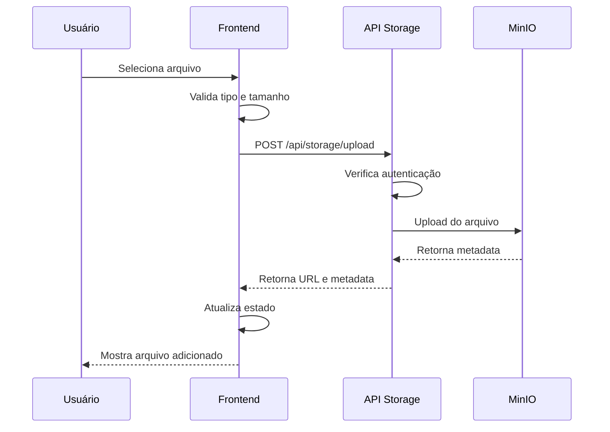

# Implementação de Storage MinIO S3

## 📋 Visão Geral

Sistema completo de armazenamento de arquivos usando MinIO S3 para gerenciar documentos, comprovantes, vouchers e outros arquivos da aplicação.

## 🗂️ Estrutura de Pastas no MinIO

```
birding-files/
├── participantes/
│   └── {participanteId}/
│       ├── {timestamp}-passaporte.pdf
│       ├── {timestamp}-identidade.pdf
│       └── {timestamp}-certificado-vacinacao.pdf
├── fornecedores/
│   └── {fornecedorId}/
│       ├── {timestamp}-contrato.pdf
│       ├── {timestamp}-cnpj.pdf
│       └── {timestamp}-certificado.pdf
├── os/
│   └── {osId}/
│       ├── {timestamp}-contrato-cliente.pdf
│       └── {timestamp}-proposta.pdf
├── pagamentos/
│   └── {pagamentoId}/
│       ├── {timestamp}-comprovante.pdf
│       └── {timestamp}-nota-fiscal.pdf
├── hospedagens/
│   └── {hospedagemId}/
│       └── {timestamp}-voucher.pdf
├── atividades/
│   └── {atividadeId}/
│       └── {timestamp}-confirmacao.pdf
├── transportes/
│   └── {transporteId}/
│       └── {timestamp}-voucher.pdf
├── passagens/
│   └── {passagemId}/
│       └── {timestamp}-bilhete.pdf
└── cotacoes/
    └── {cotacaoId}/
        └── {timestamp}-proposta.pdf
```

## 🔧 Configuração

### 1. Variáveis de Ambiente

Adicione ao seu `.env`:

```env
# MinIO S3 Storage
MINIO_ENDPOINT="localhost"
MINIO_PORT="9100"
MINIO_USE_SSL="false"
MINIO_ACCESS_KEY="minioadmin"
MINIO_SECRET_KEY="minioadmin"
MINIO_BUCKET_NAME="birding-files"
NEXT_PUBLIC_MINIO_PUBLIC_URL="http://localhost:9100"
```

### 2. Instalação do MinIO

#### Docker (Recomendado)

```bash
docker run -d \
  -p 9100:9000 \
  -p 9101:9001 \
  --name minio \
  -e "MINIO_ROOT_USER=minioadmin" \
  -e "MINIO_ROOT_PASSWORD=minioadmin" \
  -v minio_data:/data \
  quay.io/minio/minio server /data --console-address ":9001"
```

**Portas:**
- API MinIO: `9100` (mapeada da porta interna 9000)
- Console Web: `9101` (mapeada da porta interna 9001)

Acesse o console em: http://localhost:9101

#### Instalação Local

Baixe em: https://min.io/download

### 3. Aplicar Migrations

Execute a migration para adicionar os campos de arquivos:

```bash
# Aplicar via SQL direto no banco
psql $DATABASE_URL -f prisma/migrations/20260102_add_storage_fields/migration.sql

# Ou gerar o cliente Prisma
npx prisma generate
```

## 📊 Schema do Banco de Dados

Campos adicionados:

```prisma
// Participantes
model Participante {
  documentos Json? // Array de arquivos
}

// Fornecedores
model Fornecedor {
  arquivos Json? // Array de arquivos
}

// OS
model OS {
  arquivos Json? // Array de arquivos
}

// Hospedagens, Atividades, Transportes, PassagemAerea
arquivos Json? // Array de arquivos

// Cotações
model Cotacao {
  arquivos Json? // Array de arquivos
}
```

Estrutura do JSON de arquivos:

```typescript
{
  url: string          // URL pública do arquivo
  key: string          // Chave única no MinIO
  fileName: string     // Nome original do arquivo
  contentType: string  // MIME type
  size: number         // Tamanho em bytes
  uploadedAt: Date     // Data do upload
  categoria?: string   // Categoria opcional (ex: "contrato", "comprovante")
}
```

## 🔌 APIs Disponíveis

### 1. Upload de Arquivo

```typescript
POST /api/storage/upload

// FormData
{
  file: File
  folder: string      // Ex: "participantes", "fornecedores"
  entityId: string    // ID da entidade
  metadata?: string   // JSON string com metadados opcionais
}

// Response
{
  success: true,
  file: {
    url: string,
    key: string,
    size: number,
    contentType: string,
    uploadedAt: Date
  }
}
```

### 2. Download de Arquivo

```typescript
GET /api/storage/download/[key]

// Response: Stream do arquivo
```

### 3. Deletar Arquivo

```typescript
DELETE /api/storage/delete

// Body
{
  fileKey: string
}

// Response
{
  success: true,
  message: "Arquivo deletado com sucesso"
}
```

### 4. Listar Arquivos

```typescript
GET /api/storage/list?folder=xxx&entityId=xxx

// Response
{
  success: true,
  files: [
    {
      url: string,
      key: string,
      size: number,
      contentType: string,
      uploadedAt: Date
    }
  ]
}
```

## 🎨 Componente de Upload

### Uso Básico

```tsx
import { FileUpload } from '@/components/ui/file-upload'

function MeuFormulario() {
  const [arquivos, setArquivos] = useState([])

  return (
    <FileUpload
      folder="participantes"
      entityId={participanteId}
      existingFiles={arquivos}
      onFilesChange={setArquivos}
      maxFiles={5}
      maxSizeMB={10}
      acceptedTypes={['application/pdf', 'image/*']}
    />
  )
}
```

### Props do Componente

| Prop | Tipo | Padrão | Descrição |
|------|------|--------|-----------|
| `folder` | string | - | Pasta no MinIO (obrigatório) |
| `entityId` | string | - | ID da entidade (obrigatório) |
| `existingFiles` | UploadedFile[] | [] | Arquivos já existentes |
| `onFilesChange` | (files) => void | - | Callback quando arquivos mudam |
| `maxFiles` | number | 10 | Número máximo de arquivos |
| `maxSizeMB` | number | 20 | Tamanho máximo por arquivo (MB) |
| `acceptedTypes` | string[] | ['*'] | Tipos MIME aceitos |
| `disabled` | boolean | false | Desabilitar upload |

## 🔨 Serviço de Storage

### Funções Disponíveis

```typescript
import { 
  uploadFile,
  uploadMultipleFiles,
  downloadFile,
  deleteFile,
  deleteMultipleFiles,
  listEntityFiles,
  generatePresignedUrl,
  validateFileType,
  validateFileSize
} from '@/lib/storage/storage-service'

// Upload único
const fileMetadata = await uploadFile(buffer, {
  folder: 'participantes',
  entityId: 'uuid',
  fileName: 'documento.pdf',
  contentType: 'application/pdf',
  metadata: { categoria: 'passaporte' }
})

// Upload múltiplo
const files = await uploadMultipleFiles(
  [{ buffer, fileName, contentType }],
  'participantes',
  'uuid'
)

// Download
const stream = await downloadFile(fileKey)

// Deletar
await deleteFile(fileKey)

// Listar arquivos de uma entidade
const files = await listEntityFiles('participantes', 'uuid')

// URL pré-assinada (expira em 1h)
const url = await generatePresignedUrl(fileKey, 3600)

// Validações
const isValid = validateFileType('documento.pdf', ['pdf', 'doc'])
const isSizeOk = validateFileSize(fileSize, 10) // 10MB
```

## 📝 Exemplos de Integração

### 1. Formulário de Participante

```tsx
import { FileUpload } from '@/components/ui/file-upload'

function ParticipanteForm({ participanteId }) {
  const [documentos, setDocumentos] = useState([])

  const handleSubmit = async (data) => {
    // Salvar participante com documentos
    await fetch(`/api/os/${osId}/participantes`, {
      method: 'POST',
      body: JSON.stringify({
        ...data,
        documentos: documentos // Array de arquivos
      })
    })
  }

  return (
    <form onSubmit={handleSubmit}>
      {/* Outros campos */}
      
      <FileUpload
        folder="participantes"
        entityId={participanteId}
        existingFiles={documentos}
        onFilesChange={setDocumentos}
        maxFiles={5}
        acceptedTypes={['application/pdf', 'image/*']}
      />
    </form>
  )
}
```

### 2. Comprovante de Pagamento

```tsx
function PagamentoDialog({ pagamentoId }) {
  const [comprovante, setComprovante] = useState([])

  return (
    <Dialog>
      <FileUpload
        folder="pagamentos"
        entityId={pagamentoId}
        existingFiles={comprovante}
        onFilesChange={setComprovante}
        maxFiles={1}
        acceptedTypes={['application/pdf', 'image/*']}
      />
    </Dialog>
  )
}
```

### 3. Vouchers de Hospedagem

```tsx
function HospedagemSection({ hospedagemId }) {
  const [vouchers, setVouchers] = useState([])

  return (
    <div>
      <FileUpload
        folder="hospedagens"
        entityId={hospedagemId}
        existingFiles={vouchers}
        onFilesChange={setVouchers}
        maxFiles={3}
        acceptedTypes={['application/pdf']}
      />
    </div>
  )
}
```

## 🔒 Segurança

### Autenticação

Todas as rotas de storage requerem autenticação via JWT:

```typescript
Authorization: Bearer {token}
```

### Validações

- **Tipo de arquivo**: Apenas tipos permitidos
- **Tamanho**: Limite configurável por arquivo
- **Quantidade**: Limite de arquivos por entidade
- **Acesso**: Apenas usuários autenticados

### Tipos Permitidos

```typescript
export const ALLOWED_FILE_TYPES = {
  documents: ['pdf', 'doc', 'docx', 'txt', 'odt'],
  images: ['jpg', 'jpeg', 'png', 'gif', 'webp', 'svg'],
  spreadsheets: ['xls', 'xlsx', 'csv', 'ods'],
  all: [...documents, ...images, ...spreadsheets]
}
```

### Tamanhos Máximos

```typescript
export const MAX_FILE_SIZES = {
  document: 10,  // 10MB
  image: 5,      // 5MB
  general: 20    // 20MB
}
```

## 🚀 Casos de Uso

### 1. Documentos de Participantes
- Passaportes
- Identidades
- Certificados de vacinação
- Atestados médicos

### 2. Fornecedores
- Contratos
- CNPJ/documentos fiscais
- Certificados e licenças
- Apólices de seguro

### 3. Ordens de Serviço
- Contratos com clientes
- Propostas comerciais
- Roteiros detalhados
- Documentação geral

### 4. Pagamentos
- Comprovantes de pagamento
- Notas fiscais
- Recibos
- Boletos

### 5. Serviços (Hospedagem, Atividades, Transporte)
- Vouchers
- Confirmações de reserva
- Bilhetes
- Comprovantes

### 6. Cotações
- Propostas em PDF
- Anexos diversos
- Documentação complementar

## 🔄 Fluxo de Upload



## 📊 Monitoramento

### Console do MinIO

Acesse http://localhost:9101 para:
- Visualizar buckets e arquivos
- Gerenciar permissões
- Monitorar uso de espaço
- Configurar políticas de acesso

### Logs

Os logs de upload/download estão disponíveis no console do servidor Next.js.

## 🐛 Troubleshooting

### Erro: "Bucket não existe"

```bash
# Criar bucket manualmente via console MinIO
# Ou executar:
await initializeBucket()
```

### Erro: "Conexão recusada"

Verifique se o MinIO está rodando:
```bash
docker ps | grep minio
```

### Erro: "Token inválido"

Certifique-se de incluir o token JWT no header:
```typescript
headers: {
  'Authorization': `Bearer ${token}`
}
```

## 📚 Referências

- [MinIO Documentation](https://min.io/docs/minio/linux/index.html)
- [MinIO JavaScript Client](https://min.io/docs/minio/linux/developers/javascript/minio-javascript.html)
- [Next.js File Upload](https://nextjs.org/docs/app/building-your-application/routing/route-handlers#formdata)

## ✅ Checklist de Implementação

- [x] Configurar cliente MinIO
- [x] Criar serviço de storage
- [x] Adicionar campos no schema Prisma
- [x] Criar APIs de upload/download/delete/list
- [x] Criar componente de upload reutilizável
- [x] Adicionar autenticação nas rotas
- [x] Implementar validações
- [ ] Aplicar migrations no banco de dados
- [ ] Integrar componente nos formulários existentes
- [ ] Testar upload/download em produção
- [ ] Configurar backup do MinIO
- [ ] Documentar para equipe

## 🎯 Próximos Passos

1. **Aplicar migrations** no banco de dados de produção
2. **Integrar componente** em todos os formulários identificados
3. **Configurar backup** automático do MinIO
4. **Implementar compressão** de imagens (opcional)
5. **Adicionar preview** de imagens no componente
6. **Implementar drag & drop** para upload
7. **Adicionar progress bar** durante upload
8. **Configurar CDN** para servir arquivos (produção)
